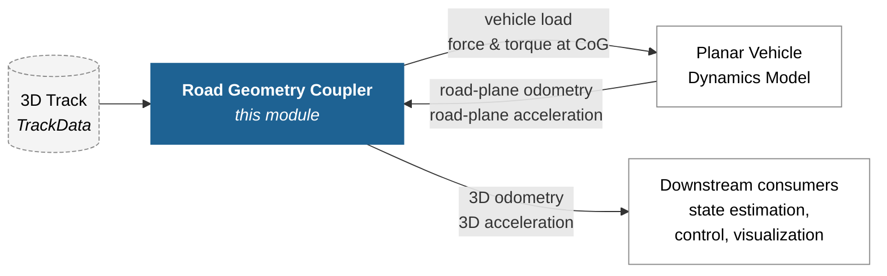

<div align="center">
    <h1>3D Road Geometry Coupling</h1>
    <p>
        <i>Beyond the Plane: Coupling Planar Vehicle Dynamics with 3D Road Geometry</i>
    </p>
</div>

<div align="center" style="margin-bottom: 30px;">
<p>
A modular, open-source C++ library that couples any planar vehicle dynamics model with 3D road geometry &mdash; without modifying the planar model itself.
The module sits between a 2D vehicle model and the 3D world: it transforms the vehicle's planar pose into its 3D pose on the actual road surface, lifts the planar measurements into 3D space, and computes the road-geometry-induced forces and moments that the planar model would otherwise miss.
This way, simpler planar models stay applicable on banked, sloped, and elevated tracks &mdash; including high-speed ovals such as the Las Vegas Motor Speedway.
</p>
</div>

<div align="center" style="margin-bottom: 30px;">

[](https://isocpp.org/)
[](https://cmake.org/)
[](https://www.apache.org/licenses/LICENSE-2.0)
<br>
[](https://www.python.org/)
[](https://docs.ros.org/en/humble/)

</div>

> **Plug-and-play with [Open Car Dynamics](https://github.com/TUMFTM/Open-Car-Dynamics).** This module accepts any planar vehicle dynamics model that can ingest external forces and moments at the center of gravity. It composes seamlessly with the planar models provided by Open Car Dynamics, but is in no way restricted to them.

---

## Table of Contents
- [1. How It Works](#1-how-it-works)
- [2. Package Overview](#2-package-overview)
- [3. Building](#3-building)
  - [3.1. Prerequisites](#31-prerequisites)
  - [3.2. C++ Library and ROS 2 Nodes](#32-c-library-and-ros-2-nodes)
  - [3.3. Python Bindings](#33-python-bindings)
- [4. Usage](#4-usage)
  - [4.1. Python](#41-python)
  - [4.2. C++](#42-c)
  - [4.3. ROS 2](#43-ros-2)
- [5. Citation](#5-citation)
- [6. Related Projects](#6-related-projects)
- [7. License](#7-license)
- [8. Acknowledgments](#8-acknowledgments)

## 1. How It Works

The library treats the planar vehicle model as a black box and never modifies it. Instead, it acts as a thin coupling layer between the planar model and the 3D track. The coupling consists of three steps, executed once per simulation cycle:

1. **Geometry transformation.** Project the vehicle's road-plane pose onto the actual 3D track surface, mapping a position on a flat 2D plane to the corresponding position on the 3D road.
2. **Measurement transformation.** Lift the planar velocity, acceleration, and angular rates into the 3D representation, accounting for the local banking, slope, and curvature of the track.
3. **Vehicle load calculation.** Compute the road-geometry-induced forces and moments to feed back into the planar model, so it experiences the same dynamic loading as a vehicle on the 3D surface.

The track surface is described by the ribbon-based representation of Perantoni et al., parametrized by a 3D reference line and a lateral offset.

The interfaces between this module and a planar vehicle dynamics model are shown below. The coupler closes the loop: it consumes the planar model's road-plane state, returns a road-geometry-induced force and moment that the planar model applies at its center of gravity, and exposes the resulting 3D state for downstream consumers.



For the full mathematical derivation, validation against real-world data from the AV21 autonomous race car on the Las Vegas Motor Speedway, and a discussion of the computational efficiency (mean execution time of \~9.5&nbsp;µs per step), please refer to the [paper](#5-citation).

## 2. Package Overview

| Package | Description |
| --- | --- |
| [`tum_road_geometry_coupling_cpp`](./tum_road_geometry_coupling_cpp/) | Core C++ library implementing the coupling algorithm. Independent of ROS 2. |
| [`tum_road_geometry_coupling_py`](./tum_road_geometry_coupling_py/) | Python bindings around the C++ library, plus a [usage example](./tum_road_geometry_coupling_py/examples/basic_usage.py). |
| [`tum_road_geometry_coupling_nodes_cpp`](./tum_road_geometry_coupling_nodes_cpp/) | ROS 2 node wrapping the library: `RoadGeometryCouplerNode`, which publishes the road-geometry-induced vehicle load as a `WrenchStamped`. |
| [`tum_road_plane_follower_cpp`](./tum_road_plane_follower_cpp/) | Demo node that drives a virtual vehicle along the road-plane reference of a 3D track and publishes road-plane odometry / acceleration. Use it to feed the coupler node end-to-end. Together with the example tracks, this can be used to reproduced the experiments of the referenced research paper (for the synthetic tracks). |

## 3. Building

The repository is built with [colcon](https://colcon.readthedocs.io/) and `ament_cmake`. The C++ library itself does not depend on ROS 2; the Python bindings and ROS 2 nodes do.

### 3.1. Prerequisites

- **OS:** Ubuntu 22.04 or 24.04
- **Compiler:** Modern C++ compiler (GCC / Clang) supporting C++17
- **Build tools:** CMake (>= 3.12), colcon, ament
- **Library dependencies:** Eigen3
- **For Python bindings or ROS 2 nodes:** ROS 2 (Humble or Jazzy)

Install the additional system dependencies via apt. When you build with `colcon --packages-up-to <one of the packages in this repo>` (as shown in the sections below), only Boost is needed:

```bash
sudo apt install libboost-dev
```

If you instead build the full workspace (including all submodule packages), also install the following ROS 2 message packages (with a sourced ROS 2 environment so that `ROS_DISTRO` is set):

```bash
sudo apt install ros-${ROS_DISTRO}-can-msgs \
                 ros-${ROS_DISTRO}-ros2-socketcan \
                 ros-${ROS_DISTRO}-geographic-msgs
```

Make sure all git submodules are properly initialized before building:

```bash
git submodule update --init --recursive
```

### 3.2. C++ Library and ROS 2 Nodes

```bash
colcon build --packages-up-to tum_road_geometry_coupling_nodes_cpp --cmake-args -DCMAKE_BUILD_TYPE=Release
```

After sourcing `install/setup.sh`, the available components and executables can be inspected via:

```bash
ros2 component types tum_road_geometry_coupling_nodes_cpp
ros2 pkg executables tum_road_geometry_coupling_nodes_cpp
```

### 3.3. Python Bindings

```bash
colcon build --packages-up-to tum_road_geometry_coupling_py --cmake-args -DCMAKE_BUILD_TYPE=Release
```

After sourcing the install folder, the Python module `tum_road_geometry_coupling_py` becomes importable.

### 3.4. Docker

A [`Dockerfile`](./Dockerfile) is provided that builds on top of `ros:jazzy`, installs all required apt dependencies, fetches the submodules, and compiles the workspace inside the image. From the repository root:

```bash
docker build -t road-geometry-coupling .
```

To start a container with the workspace already sourced:

```bash
docker run -it --rm road-geometry-coupling
```

## 4. Usage

> **Important — keep the vehicle progressing gradually along the track.** Internally, the geometry transformation works on a rolling segment of the reference line that is rebuilt on demand as the vehicle advances. If the vehicle's road-plane pose jumps too far ahead in a single step, the next call to `step()` may land outside the current segment and the rebuild can produce inconsistent results. As a rule of thumb, **keep the per-step longitudinal progress below \~10&nbsp;m**, which is well within the safe range for any realistic simulation timestep.

### 4.1. Python

```python
import tum_road_geometry_coupling_py as rgc
from tum_types_py.control import Odometry, AccelerationwithCovariances

# Load one of the bundled example tracks (or your own CSV with matching headers).
track = rgc.load_track_data_from_csv("example_tracks/flat_track.csv")

coupler = rgc.RoadGeometryCoupler(track)
coupler.set_odometry(odom_road_plane)
coupler.set_acceleration(accel_road_plane)
coupler.step()

global_odom = coupler.get_transformed_odometry()
global_accel = coupler.get_transformed_acceleration()
load = coupler.get_vehicle_load()  # force_N + torque_Nm to feed back to the planar model
```

A complete runnable example lives in [tum_road_geometry_coupling_py/examples/basic_usage.py](./tum_road_geometry_coupling_py/examples/basic_usage.py). Four example tracks ship under [`example_tracks/`](./example_tracks/) (`flat_track.csv`, `elevated_track.csv`, `fully_banked_track.csv`, `vertically_banked_track.csv`); their CSV columns match the `TrackData` fields one-to-one.

### 4.2. C++

```cpp
#include "tum_road_geometry_coupling_cpp/road_geometry_coupler.hpp"
#include "tum_road_geometry_coupling_cpp/track_data.hpp"
#include "tum_road_geometry_coupling_cpp/track_data_io.hpp"

namespace rgc = tam::road_geometry_coupling;

// Either load from one of the bundled CSVs or populate TrackData manually.
auto track_data = rgc::load_track_data_from_csv("example_tracks/flat_track.csv");
auto coupler = std::make_unique<rgc::RoadGeometryCoupler>(std::move(track_data));

coupler->set_odometry(odom_road_plane);
coupler->set_acceleration(accel_road_plane);
coupler->step();

auto global_odom = coupler->get_transformed_odometry();
auto global_accel = coupler->get_transformed_acceleration();
auto vehicle_load = coupler->get_vehicle_load();
```

### 4.3. ROS 2

One ROS 2 node is provided:

- **`RoadGeometryCouplerNode`** &mdash; road-geometry coupling. Subscribes to road-plane odometry and acceleration, publishes the transformed 3D quantities and the road-geometry-induced vehicle load as a `geometry_msgs/WrenchStamped`. The wrench is one source for the external-influence aggregator, which combines it with any other force / grip / road-height sources.

It can be run as a standalone executable or loaded as a composable component inside a `component_container`. See [`tum_road_geometry_coupling_nodes_cpp`](./tum_road_geometry_coupling_nodes_cpp/) for parameters and topic interfaces.

## 5. Citation

If you use this library in your work, please cite our paper:

> Sagmeister, S.; Pitschi, P.; Haja, N,; Lienkamp, M. *Beyond the Plane: Coupling Planar Vehicle Dynamics with 3D Road Geometry.*

A BibTeX entry will be added once the paper is published.

## 6. Related Projects

- **[Open Car Dynamics](https://github.com/TUMFTM/Open-Car-Dynamics)** &mdash; an open-source library of modular, real-time vehicle dynamics models. This module is designed to compose with any planar model exposing an external-force-and-moment input, including the planar models from Open Car Dynamics. Together they form a complete pipeline for simulating planar vehicle dynamics on real 3D race tracks.

## 7. License

This project is licensed under the Apache License 2.0 &mdash; see the [LICENSE](./LICENSE) file for details.

## 8. Acknowledgments

Parts of this Repository (Code, Documentation) were refined using AI Tools (Claude Opus 4.7, Gemini 3.1)

### Core Developers
- [Simon Sagmeister](https://github.com/simonsag96)

### Contributors
- [Phillip Pitschi](https://github.com/phillpi)

### Funding
We gratefully acknowledge financial support by:
- Deutsche Forschungsgemeinschaft (DFG, German Research Foundation) &mdash; Project Number 469341384
